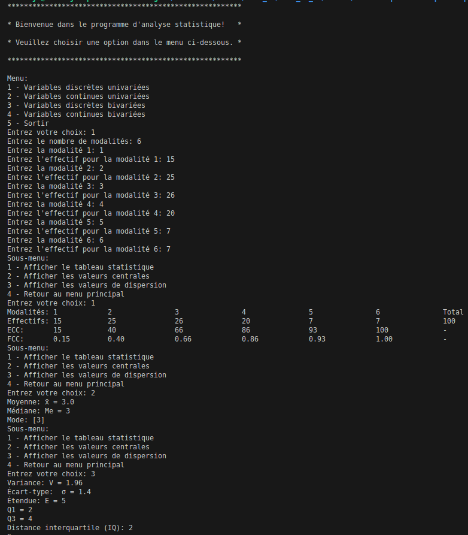
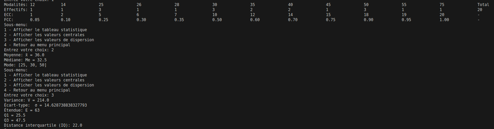
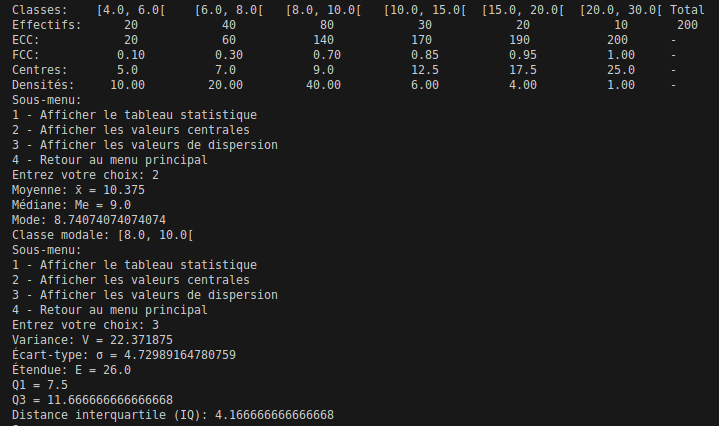
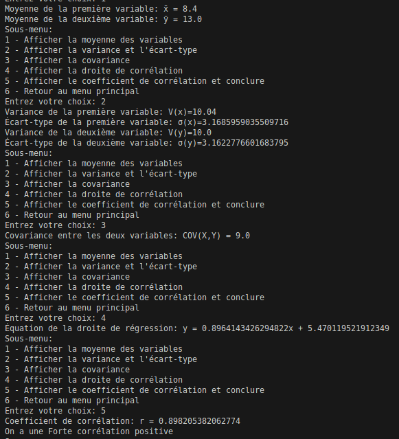
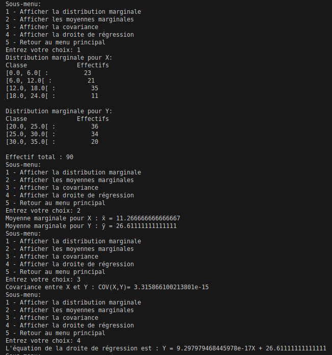

# 📊 Outil d’Analyse Statistique Descriptive en Python

## 🎯 Objectif

Ce projet est un outil en **Python** permettant d’effectuer des analyses statistiques descriptives sur différents types de variables.  
Il a été conçu comme un projet personnel afin de démontrer :

- La maîtrise de **Python** (structuration de code, menus interactifs, modularité),
- La compréhension des **concepts de statistique descriptive** (valeurs centrales, dispersion, corrélation…),
- La capacité à transformer ces concepts en un programme pratique.

---

## ⚙️ Fonctionnalités principales

### 1️⃣ Variables discrètes univariées

- Tableau statistique : effectifs, ECC, FCC  
- Valeurs centrales : moyenne, médiane, mode  
- Valeurs de dispersion : variance, écart-type, étendue, quartiles, interquartile  

### 2️⃣ Variables continues univariées

- Tableau statistique : classes, centres, densités, ECC, FCC  
- Valeurs centrales : moyenne, médiane, mode, classe modale  
- Valeurs de dispersion : variance, écart-type, étendue, quartiles, interquartile  

### 3️⃣ Variables discrètes bivariées

- Moyennes des deux variables  
- Variances et écarts-types  
- Covariance  
- Droite de régression  
- Coefficient de corrélation (avec interprétation)  

### 4️⃣ Variables continues bivariées

- Distribution marginale  
- Moyennes marginales  
- Covariance  
- Droite de régression  

---

## 📂 Structure du projet
```
Statistiques-descriptives-python/
├── main.py        # Programme principal avec menu interactif
├── function.py    # Fonctions de calculs statistiques
├── README.md      # Documentation du projet
└── screenshots/   # Captures d’écran (menu + résultats des 4 parties)
````

---

## 🚀 Utilisation

1. **Cloner le projet en local** :
   ```bash
   git clone https://github.com/juniorpointeu/Statistiques-descriptives-python.git
   cd Statistiques-descriptives-python
   ````

2. **Exécuter le programme** :
   ```bash
   python main.py
   ````

3. **Suivre le menu interactif** pour entrer les données et choisir l’analyse à effectuer.

---

## 📸 Captures d’écran

### Menu principal



### Variables discrètes univariées



### Variables continues univariées



### Variables discrètes bivariées



### Variables continues bivariées



---

## 🛠️ Technologies utilisées

* **Langage** : Python 3
* **Modules** : uniquement les fonctions natives (`input()`, `print()`, `sqrt()`)

---

## 👤 Auteur

Développé par **Junior Pointeu**
👉 Retrouvez d’autres projets sur mon GitHub : [juniorpointeu](https://github.com/juniorpointeu)


